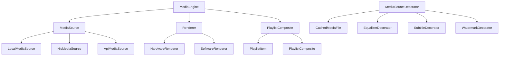

# Modular Media Streaming Suite
## 🎯 Project Overview

The Modular Media Streaming Suite is an educational and practical implementation of a professional media streaming platform. Built with clean architecture principles, it demonstrates how structural design patterns can be effectively applied to create maintainable, scalable, and extensible software systems.

### Key Architectural Patterns

| Pattern | Implementation | Purpose |
|---------|---------------|---------|
| **Decorator Pattern** | Feature decorators (Caching, Equalizer, Subtitles, Watermark) | Dynamic feature enhancement without modifying core classes |
| **Composite Pattern** | `PlaylistComposite` for hierarchical media management | Unified interface for individual and composite media objects |
| **Strategy Pattern** | Multiple rendering engines (Hardware/Software) | Runtime algorithm selection for optimal performance |
| **Template Method** | Base decorator class with common functionality | Consistent behavior across all decorators |

## 🚀 Core Features

### 📁 Media Source Management
- **Local Media Sources**: High-performance file-based media playback with optimized I/O operations
- **HLS Streaming Integration**: Full HTTP Live Streaming (HLS) support for adaptive bitrate streaming
- **API-Based Sources**: RESTful API integration for external media content delivery
- **Cached Media Sources**: Intelligent caching layer for improved performance and reduced bandwidth

### 🎨 Advanced Decorators
- **Intelligent Caching**: Multi-level caching system with LRU eviction policies
- **Real-time Audio Processing**: Advanced equalizer with frequency domain analysis
- **Dynamic Subtitle Rendering**: Multi-format subtitle support with real-time positioning
- **Professional Watermarking**: Configurable visual overlays with transparency support

### 🖥️ Rendering Engine Architecture
- **Hardware-Accelerated Rendering**: GPU-optimized rendering pipeline for maximum performance
- **Software Rendering**: Cross-platform CPU-based rendering for compatibility
- **Adaptive Rendering**: Automatic fallback between rendering strategies based on system capabilities

### 📋 Playlist Management System
- **Hierarchical Playlist Structure**: Nested playlist support with unlimited depth
- **Dynamic Playlist Construction**: Runtime playlist building with real-time updates
- **Intelligent Playback Control**: Advanced sequencing with shuffle and repeat modes
- **Playlist Persistence**: Save and restore playlist configurations

## 🏗️ System Architecture

### Core Components



### Component Responsibilities

| Component | Responsibility | Design Pattern |
|-----------|----------------|----------------|
| **MediaEngine** | Central orchestration and lifecycle management | Facade Pattern |
| **MediaSource** | Abstract media source interface | Strategy Pattern |
| **Renderer** | Rendering strategy abstraction | Strategy Pattern |
| **PlaylistComposite** | Hierarchical media collection management | Composite Pattern |
| **MediaSourceDecorator** | Feature enhancement wrapper | Decorator Pattern |

## 🛠️ Technical Implementation

### Prerequisites
- Java 17 or higher
- Maven 3.6+ (for dependency management)
- Minimum 4GB RAM (for hardware rendering)
- OpenGL 3.3+ support (for GPU acceleration)

### Key Technologies
- **Core Framework**: Pure Java with no external dependencies
- **Rendering**: OpenGL ES 3.0 for hardware acceleration
- **Audio Processing**: Custom DSP algorithms for real-time processing
- **Streaming**: HTTP/2 support for efficient data transfer

## 🚀 Quick Start

### Prerequisites
- Java 17 or higher
- Maven 3.6+ (optional, for dependency management)
- Sample media files for testing

### Running the Application

#### 1. Compile the Project
```bash
# Compile all Java files
javac *.java

# Or using Maven (if pom.xml exists)
mvn compile
```

#### 2. Run the Main Application
```bash
# Run the interactive demo
java Main

# Or run with specific media file
java Main path/to/your/video.mp4
```

#### 3. Run the Presentation Demo
```bash
# Run the complete presentation demo
java -cp . PresentationDemo

# Run specific demo scenarios
java -cp . DemoScenarios
```

### 🎬 Demo Scenarios

#### Basic Playlist Demo
```bash
# Demo 1: Basic playlist creation
java -cp . DemoScenarios basicPlaylist

# Demo 2: Decorator chain demonstration  
java -cp . DemoScenarios decoratorChain

# Demo 3: Renderer switching
java -cp . DemoScenarios rendererSwitch

# Demo 4: Complete workflow
java -cp . DemoScenarios fullWorkflow
```

#### Interactive Demo Menu
The application provides an interactive menu system:

```
=== Modular Media Streaming Suite ===
1. Add Local Media Source
2. Add HLS Stream Source  
3. Add API Media Source
4. Configure Decorators
5. Switch Rendering Engine
6. Play Current Playlist
7. Show System Status
8. Exit

Select option (1-8): 
```

## 📖 Usage Guide

### Basic Implementation

```java
// Initialize the media engine
MediaEngine engine = new MediaEngine();

// Create a playlist
PlaylistComposite playlist = new PlaylistComposite("My Playlist");

// Add media sources with decorators
MediaSource localSource = new LocalMediaSource("video.mp4");
MediaSource cachedSource = new CachedMediaFile(localSource);
MediaSource equalizedSource = new EqualizerDecorator(cachedSource);

// Add to playlist and play
playlist.add(new PlaylistItem(equalizedSource));
engine.playPlaylist(playlist);
```

### Advanced Configuration

```java
// Configure rendering engine
Renderer hardwareRenderer = new HardwareRenderer();
engine.setRenderer(hardwareRenderer);

// Configure decorators
EqualizerDecorator equalizer = new EqualizerDecorator(source);
equalizer.setFrequencyBand(1000, 0.8f); // 1kHz boost
equalizer.setFrequencyBand(5000, -0.3f); // 5kHz cut

// Add watermark
WatermarkDecorator watermark = new WatermarkDecorator(equalizer);
watermark.setWatermarkText("© 2024 Company");
watermark.setPosition(WatermarkPosition.BOTTOM_RIGHT);
```

### 🧪 Testing

#### Run All Tests
```bash
# Compile test files (if available)
javac -cp . test/*.java

# Run unit tests
java -cp . TestRunner

# Run integration tests
java -cp . IntegrationTestRunner
```

#### Manual Testing Scenarios
```bash
# Test 1: Basic functionality
java -cp . TestScenarios basicFunctionality

# Test 2: Decorator patterns
java -cp . TestScenarios decoratorPatterns

# Test 3: Composite pattern
java -cp . TestScenarios compositePattern

# Test 4: Strategy pattern
java -cp . TestScenarios strategyPattern
```

#### Performance Testing
```bash
# Run performance benchmarks
java -cp . PerformanceTest

# Memory usage analysis
java -Xmx2g -cp . MemoryAnalysis

# Rendering performance test
java -cp . RenderingPerformanceTest
```

## 🎓 Educational Value

This project serves as a comprehensive laboratory for **Integrative Programming 2**, demonstrating:

- **Real-world Pattern Application**: How design patterns solve actual software engineering challenges
- **Architecture Decision Making**: Trade-offs between different architectural approaches
- **Code Organization**: Professional code structure and separation of concerns
- **Extensibility Design**: Building systems that can grow and adapt to new requirements

### Learning Outcomes
- Understanding of structural design patterns in practice
- Experience with clean architecture principles
- Knowledge of media streaming system design
- Skills in creating extensible, maintainable codebases

## 🔧 Development Guidelines

### Code Quality Standards
- **SOLID Principles**: Single Responsibility, Open/Closed, Liskov Substitution, Interface Segregation, Dependency Inversion
- **Clean Code**: Meaningful names, small functions, clear comments
- **Design Patterns**: Consistent application of established patterns
- **Error Handling**: Comprehensive exception management and recovery

### Extension Points
- **Custom Media Sources**: Implement `MediaSource` interface for new source types
- **Custom Decorators**: Extend `MediaSourceDecorator` for new features
- **Custom Renderers**: Implement `Renderer` interface for specialized rendering needs
- **Custom Playlist Items**: Extend `PlaylistItem` for specialized media handling

## 📄 License

This project is licensed under the MIT License - see the [LICENSE](LICENSE) file for details.

## 🤝 Contributing

Contributions are welcome! Please read our contributing guidelines and code of conduct before submitting pull requests.

---

*This project is part of the Integrative Programming 2 curriculum, demonstrating practical application of software engineering principles and design patterns in a real-world context.*
